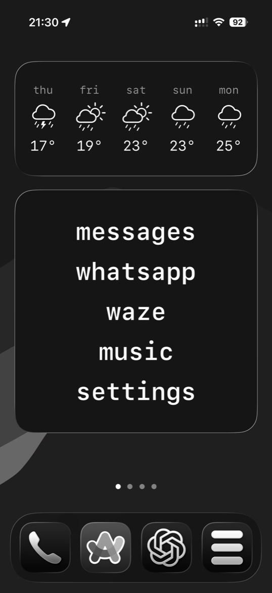
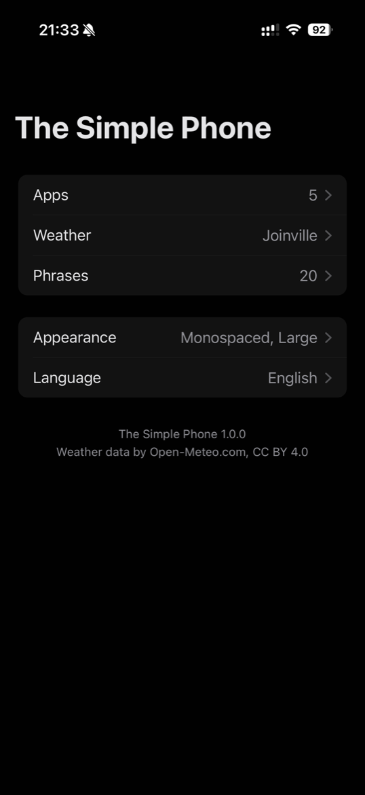
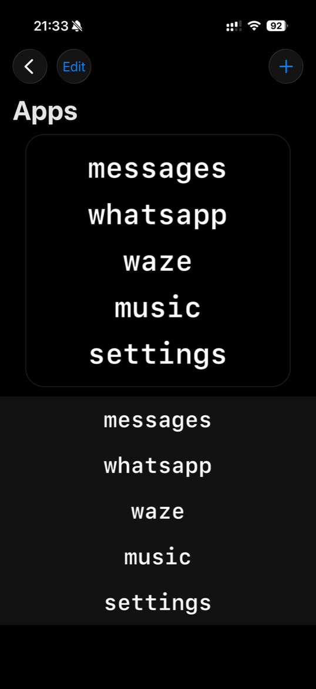
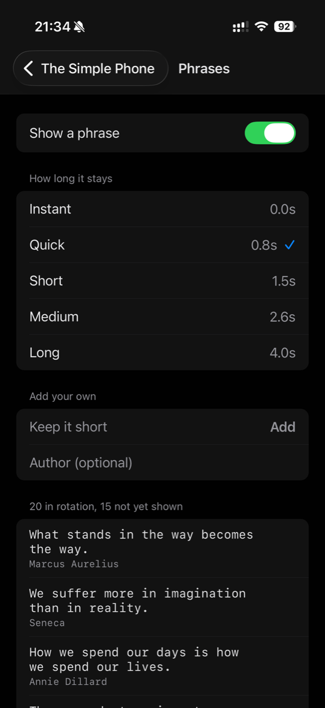
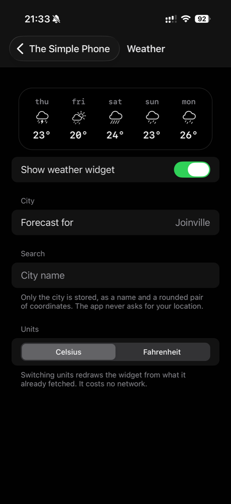
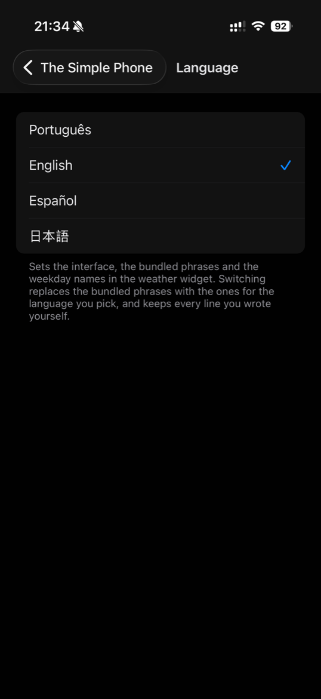

# The Simple Phone (TSP)

A calm home-screen launcher for iPhone. Your apps become a list of names in plain text. No icons, no
badges, no grid. You tap a name, the app it points at opens. That is the whole product.

<p align="center">
  
</p>

<p align="center"><em>The home screen. Two widgets, no icons, no badges.</em></p>

## Why this exists

I wanted a dumber phone, not a different one. The stock home screen is a grid of coloured squares
competing for attention, and the apps I actually use every day are five of them. Everything else is
noise I scroll past.

There are paid apps that do this. I looked at one, decided the licence cost more than the idea was
worth to me, and noticed I would use maybe a third of what it shipped. So I built the third I wanted.

That is the honest origin: this is a personal tool that turned out to be worth publishing. It is
going to the App Store, and the source is here either way.

## Why React Native

This app was going to be Swift. The original version, in fact, was: there is a companion repo where
the whole thing is SwiftUI, and this is a rebuild.

I changed my mind because I wanted the exercise. My daily work is Ruby, Rails and React, and it had
been years since I wrote anything in React Native. I wanted to see what the framework had become
rather than what I remembered it being. Picking a real app with a real deadline, instead of a toy,
is the only way that question gets an honest answer.

The answer, so far: the JavaScript half is genuinely pleasant, and everything that touches the
system is still native. Which is why roughly a third of this repo is Swift, and why the widget was
never going to be anything else.

## The two halves

This is one Expo project that produces two things:

- **The Simple Phone**, an iOS app in React Native and TypeScript. It is the editor. Add apps,
  reorder them, delete them, change the type, set the weather city, write your own phrases.
- **SimplePhoneWidget**, a WidgetKit extension in SwiftUI. It is the product surface. The list that
  actually sits on your home screen, plus the weather strip.

They are separate processes that never talk to each other directly. The only channel between them is
a shared `UserDefaults` suite (an App Group) holding one JSON string. Most of the hard-won detail in
this README is downstream of that single fact.

## The app

The app is the editor, and it is deliberately boring. Everything it does ends as one JSON string in
a shared container that the widget reads.

<p align="center">
  
  
  
</p>

<p align="center">
  
  
</p>

The **Apps** screen puts a live preview of the widget directly above the list you are editing, so
reordering is a direct-manipulation act rather than a guess followed by a home-screen check.

The **Weather** strip is optional and asks for nothing. It never requests your location. You type a
city, and what gets stored is a name and a rounded pair of coordinates. Data comes from
[Open-Meteo](https://open-meteo.com), CC BY 4.0, attributed in the app.

**Language** changes four things at once: the interface, the bundled app names, the bundled phrases,
and the weekday names in the weather widget. The bundled app names are localised rather than fixed,
because a launcher row that does not read the way your home screen reads has to be translated in your
head every time you look at it. Anything you renamed stays yours and never moves.

## The phrase between the taps

Tapping a widget row cannot open a third party app directly. iOS will not allow it. The tap has to
land in the host app first, which then forwards you on. That round trip is visible, and there is no
way to hide it.

So instead of apologising for the flash, the app fills it. Every hop shows a phrase, held for as long
as you choose, and then you arrive where you were going. A limitation of the platform became the one
moment of stillness in the launch.

Twenty phrases ship per language, each attributed, each drawn from that language's own tradition
rather than translated from English. You can add your own, and yours are never touched when you
switch languages.

**Hold the screen and the phrase stays.** Press anywhere while it is up and the handoff waits; lift
your thumb and you go. It is worth setting a duration of Short or longer to use this: at Instant the
phrase is only on screen for the app-switch animation, and there is barely a window for a finger to
land in. The rule lives in `ios/SimplePhone/RelayGate.swift` and is the one native thing here with
its own test suite.

## Project layout

```
app.json                  JS-side config only: scheme, name, router, build properties.
ios/                      the Xcode project. TWO TARGETS. COMMITTED SOURCE, not output.
  SimplePhone/            the app target: AppDelegate, Info.plist, entitlements, the relay.
  SimplePhoneWidget/      the WidgetKit extension: launcher list, weather, timeline provider.
modules/launcher-native/  a local Expo module in Swift. The config bridge.
src/
  app/                    screens (expo-router).
  components/             shared views.
  domain/                 pure logic: quotes, deep links, bundled defaults, weather codes.
  i18n/                   four languages, interface strings included.
  store/                  the config store and the JSON contract with Swift.
  theme/                  fonts and sizing tables.
docs/native-notes.md      the teaching document for the native half.
scripts/                  brand asset generation.
AGENTS.md                 the rules file. Read it before writing code here.
```

Two things about this layout are unusual and deliberate:

**`ios/` is committed source, not generated output.** That is the opposite of a default Expo project.
It is why `npx expo prebuild` must never run here, and it has its own section below.

**The widget is Swift and always will be.** WidgetKit has no JavaScript runtime. There is no version
of this where the home-screen surface is written in TypeScript, and no library that changes that.
Also below.

## Technical decisions, in one list

Each of these has a full section further down explaining the reasoning and what breaks if you get it
wrong. They are the parts worth reading before changing anything.

| Decision | Short version |
| --- | --- |
| Widget in SwiftUI | WidgetKit runs no JS. Not a preference, a constraint. |
| Bare project | `ios/` is committed. `prebuild` would delete it without asking. |
| The relay | A widget tap goes to the host app first, then forwards. Nothing avoids this. |
| Own URL scheme | `simplephonern`, not `simplephone`, so the Swift original can coexist. |
| Config as a JSON string | Never object bridging. Bridging coerces `true` to `1` and Swift then throws away every app you added, silently. |
| App Group id in two files | Byte identical, or signing fails with an unrelated error. |
| Widget `kind` string frozen | Renaming it blanks every widget already placed, permanently, with no migration API. |

## Tests

`npx tsc --noEmit` and `npm test` both have to be clean before anything is called done. TypeScript is
strict, with no `any` and no `@ts-ignore`.

There are 257 tests, and the suite has an opinion about what deserves one. Everything worth testing
here is a pure function, and the coverage concentrates on the four places where being wrong is
**silent** rather than loud:

| Under test | What it costs to get wrong |
| --- | --- |
| the config decoder | every app you added, with no error anywhere |
| language switching | every phrase you wrote, with no undo |
| deep link parsing | a widget tap that opens nothing, or the wrong thing |
| quote stats parsing | a settings screen that crashes on a stale blob |

Three rules keep it useful:

- **Test the failure, not the happy path.** Almost every case in the decoder suite is malformed
  input, because malformed input is what actually reaches that code.
- **Prove the test bites.** Before trusting one that guards data, run it against a wrong
  implementation and watch it go red. The language switcher has three plausible wrong versions, and
  all three fail the suite.
- **Fixtures go through a decode.** A quote loaded from disk is never the same object as the bundled
  one it came from, so a fixture that reuses bundled references passes tests a real device fails.

## Roadmap

- **App Store submission**, in the next few days. The blockers are documented under "App Store risk"
  below, and `App-Prefs://` has to come out of the shipped defaults first.
- **Phrase surface as a place for a sponsor slot.** The hop already holds your attention for a
  second; if this ever carries advertising, that is where it goes, and a paid tier removes it. Not
  built, not decided, written down so the intent is public.
- **More languages**, if people want them. The interface, the bundled app names and the phrase
  catalogue are all localised already, so adding one is data, not code.

## Contributing

Suggestions are welcome, including "this is the wrong way to do it". Open an issue before a large
pull request so we can agree on the shape first.

Two things to read before writing code:

- **`AGENTS.md`** is the rules file. It lists the four ways to silently destroy user data in this
  codebase, and every one of them has already happened once.
- **`docs/native-notes.md`** explains the native half: WidgetKit lifecycle, `TimelineProvider`, what
  an Expo local module actually is, and what "bare vs CNG" means.

House style: English everywhere, Conventional Commits, no emojis. Comment the native side
generously and obvious TypeScript not at all. The point of the Swift in this repo is to be readable
by someone learning it.

## License

MIT. See [LICENSE](LICENSE).

You can read it, fork it, learn from it and ship your own. The App Store build is mine to publish,
and the source is yours to use.

---

## Why the widget is still SwiftUI

This is the first question anyone asks, so it goes first.

**A widget extension has no JavaScript runtime.** Not a slow one, not a limited one. None.

A WidgetKit widget is not a live app view. Your extension process is woken by the system, asked to
produce a *timeline* of entries, renders a SwiftUI view tree for each one, and is then killed. The
system archives that rendered tree and draws it on the home screen whenever it likes, with your
process long dead. The thing on your home screen is not running code. It is a picture of a view
hierarchy that the system knows how to re-lay-out and re-tint.

There is nowhere in that lifecycle to boot Hermes, connect to Metro, or run a React reconciler. No
bridge exists. No JSI host object exists. The extension gets a few seconds of CPU, must hand back a
finished view tree, and dies. So the widget is Swift, and it will stay Swift.

### What about `expo-widgets`?

`expo-widgets@57.0.9` exists and has been first-party stable since SDK 56. It is a real solution and
it works. What it actually does is let you *author* widget UI in TypeScript through
`@expo/ui/swift-ui`, which is then translated into a SwiftUI view tree at build time. Your
TypeScript is not running inside the extension either. It is a description that gets compiled down.

There is no documented escape hatch for dropping in your own Swift when the abstraction runs out.
That makes `expo-widgets` the right tool if the goal is to ship a widget, and the wrong tool if the
goal is to understand WidgetKit. This project's goal is the second one, so the widget is hand-written
Swift in a target this repo owns.

---

## This is a bare project

**`ios/` is source. It is committed. You edit it, in Xcode, by hand.**

That is a deliberate choice and it is the opposite of the Expo default. Worth understanding, because
almost every Expo tutorial you will find assumes the other model.

### Bare vs CNG, in one table

Expo has two ways to own the native project. Modern docs call them "with CNG" and "without CNG";
older docs call them "managed" and "bare".

|                        | CNG (Expo's default)                  | Bare (this project)             |
| ---------------------- | ------------------------------------- | ------------------------------- |
| `ios/`                 | generated, gitignored                 | committed, hand-edited          |
| Source of truth        | `app.json` + config plugins           | the Xcode project itself        |
| Add a native target    | a config plugin writes the pbxproj    | you add it in Xcode             |
| Icon, splash, Info.plist | `app.json`                          | Xcode, by hand                  |
| `npx expo prebuild`    | the normal workflow                   | **forbidden — it would wipe `ios/`** |
| Upgrading Expo / RN    | regenerate and move on                | manual native merge             |

CNG buys cheap upgrades at the cost of never really seeing the native project. Bare costs you the
upgrade path and hands you the thing itself.

### Why bare here

Two reasons, and the second is the load-bearing one.

1. **Learning.** The point of this rebuild was to understand the native side. Under CNG the Xcode
   project is a black box that a plugin regenerates; you learn the plugin's config format, not
   Xcode. Here you can open `SimplePhone.xcodeproj`, see two targets, see the embed phase that puts
   the `.appex` inside the app, and change any of it.
2. **One less fragile dependency.** Getting a hand-written Swift extension into a CNG project needs
   `@bacons/apple-targets`. That package generated the target in this repo originally and it worked,
   but it is a single-maintainer project whose pbxproj writer (`@bacons/xcode`) is still
   `1.0.0-alpha.32`, whose docs site returns HTTP 410, and whose SDK 57 support was unverified until
   this project tested it. Under bare it is not a dependency at all — it did its job once and was
   removed. The generated target it produced is now just part of the committed project.

### The rule

```bash
npx expo prebuild        # NEVER. It clears and regenerates ios/ by default as of
                         # SDK 57 (@expo/cli PR #47209), with no prompt.
```

Everything else is normal:

```bash
cd ios && pod install    # fine, and required after changing JS dependencies
```

`pod install` only rewrites `Pods/` and the workspace. It does not touch `SimplePhone.xcodeproj`.

`app.json` still exists and still configures the JavaScript side (scheme, name, Expo Router,
`expo-build-properties`). What it no longer does is drive the native project. If you change
`ios.bundleIdentifier` or `ios.entitlements` there, **nothing happens** — those values were baked
into the Xcode project when it was generated, and Xcode is now the only place they live.

### Layout

```
ios/
  SimplePhone.xcodeproj/     the project. Two targets. COMMITTED.
  SimplePhone/               the app target: AppDelegate, Info.plist, entitlements.
  SimplePhoneWidget/         the widget extension: Swift, Info.plist, entitlements.
  Podfile / Podfile.lock     COMMITTED. Pods/ is not.
modules/launcher-native/     local Expo module (Swift). Autolinked by CocoaPods.
src/                         the React Native app.
```

`ios/SimplePhoneWidget/` is a `PBXFileSystemSynchronizedRootGroup` — an Xcode 16+ synchronized
folder. Any `.swift` file you drop in there joins the target automatically, with no pbxproj edit.
`Info.plist` and the entitlements are excluded from compilation by a membership exception.

---

## The relay story

**A widget tap can never open a third-party app.** This is not a limitation of this project, of
Expo, or of SwiftUI. It is iOS. When you tap a widget, the system launches the widget's *own host
app* and hands it the URL. Put `whatsapp://` in a widget `Link` and the tap silently does nothing.

So the widget links at itself and asks the app to finish the job:

```
Widget row  ->  simplephonern://open?u=whatsapp%3A%2F%2F
                          |
                          v
          iOS launches Simple Phone with that URL
                          |
                          v
   AppDelegate parses it natively, BEFORE React Native starts
                          |
                          v
          Linking.openURL("whatsapp://")  ->  WhatsApp opens
                          |
                          v
          router.back() pops the relay screen
```

**The flash is expected.** Simple Phone genuinely launches, for real, on every widget tap. You will
see it for a fraction of a second before the target app takes over. There is no way around it and no
API to suppress it. Do not treat it as a bug to fix.

### The scheme is `simplephonern`, not `simplephone`

The old native Swift app owns `simplephone` and may still be installed on the same device. When two
installed apps register the same URL scheme, iOS picks a winner arbitrarily and does not tell you
which. So this port registers `simplephonern` and the two coexist cleanly. If you ever delete the
old app for good and want the shorter scheme back, changing it means changing `app.json`,
`ios/SimplePhoneWidget/DeepLink.swift` and `src/domain/deepLink.ts` together, and every already-placed
widget keeps pointing at the old scheme until its timeline is reloaded.

### The SwiftUI asymmetry: `Link` vs `widgetURL`

`ios/SimplePhoneWidget/WidgetViews.swift` has two rendering paths that look like they could be one. They
cannot:

- **`systemMedium` and `systemLarge`** wrap each row in a SwiftUI `Link`, so each row opens its own
  target. Taps that land on the padding or the gaps between rows fall through to a plain host-app
  launch, because those layouts deliberately set no `widgetURL`.
- **`systemSmall` ignores `Link` entirely.** WidgetKit routes taps in the small family through
  `widgetURL` only. That is why `smallView` shows exactly one app (`apps.first`) and makes the whole
  surface tappable with `.widgetURL(...)`.

You get **one** `widgetURL` per widget and it covers the entire surface. Adding one to the list
layout would shadow the per-row `Link`s. Unifying the two paths under `Link` would produce a small
widget that opens Simple Phone and stops there.

### Failure used to be a silent no-op. It is an alert now.

If the target app is not installed, the open fails and `AppDelegate.presentFailure` shows a
localized alert built from the `relay` block in `quotes.json`.

The original swallowed it: a row for an app you do not have simply did nothing, which is
indistinguishable from opening the wrong app or from a scheme Apple changed, and costs hours to
diagnose. The copy comes from a bundled resource rather than a JS catalog because this runs on a
cold launch where React Native may have no bridge yet.

This is faithful to the original `URLRelay.swift`, which had the same empty failure branch and a
`TODO` about falling back to an App Store listing. It is a known gap carried forward on purpose. If
you decide to fix it, fix it deliberately and update this section. Do not "fix" it by accident while
tidying up a `catch` block.

---

## The App Group story

```
App Group id:      group.com.guilherme44.simple-phone
UserDefaults key:  launcher_config
Value:             one JSON string (UTF-8)
```

An App Group is a shared container: a `UserDefaults` suite (and a shared filesystem directory) that
two signed binaries from the same team are both entitled to read and write. It is the only channel
between the app and the widget. There is no IPC, no notification, no shared memory. The app writes
JSON, calls `WidgetCenter.reloadAllTimelines()`, and the extension reads that JSON the next time the
system wakes it.

Note that the group id keeps the **old** `simple-phone` suffix even though this app's bundle id is
`com.guilherme44.simple-phone-rn`. That is deliberate: it is what lets a phone carrying the old
app's data keep it.

### Byte-identical in two places

The group id appears literally in two files and must match exactly. A stray space fails signing,
usually with a message that does not mention the group at all:

- `ios/SimplePhone/SimplePhone.entitlements`
- `ios/SimplePhoneWidget/SimplePhoneWidget.entitlements`

Both are plain plists in the Xcode project. (`app.json` also lists the group under
`expo.ios.entitlements`, but that is now inert documentation: nothing reads it, because this project
does not run prebuild.) Verify the two that matter:

```bash
plutil -p ios/SimplePhone/SimplePhone.entitlements
plutil -p ios/SimplePhoneWidget/SimplePhoneWidget.entitlements
```

Both must print the same single-element array.

### The free-team history, told honestly

This repo's `AGENTS.md` asserted for a long time that a free Apple personal team **cannot** sign App
Groups on iOS, and that device signing fails outright. Both `entitlements:` blocks in the old
`project.yml` were commented out for that reason.

That was re-tested on **2026-08-12** with Xcode 26.6 against team `2L3TMGME4A`, and it did not
reproduce. The developer portal issued **both** provisioning profiles carrying
`com.apple.security.application-groups`, and the team's fetched capability manifest lists
`APP_GROUPS` with `XCODE_FREE_PROGRAM` among its `validTeamTypes`.

Status, stated precisely:

- **Verified:** profile issuance for both targets, and shared-container creation in the simulator.
- **Not verified:** installing and launching on a physical iPhone with a genuinely shared container.
  The test phone was locked and `devicectl` failed with `kAMDMobileImageMounterDeviceLocked`. Five
  minutes with an unlocked device settles it.
- **Unknown:** whether this is a deliberate Apple policy change, an account-specific quirk, or
  something Apple could revert. No announcement and no dated third-party report was found. Most
  published guidance still says the opposite.

### The fallback, and why it must stay

`ios/SimplePhoneWidget/ConfigStore.swift` reads:

```swift
UserDefaults(suiteName: AppGroup.id) ?? .standard
```

`modules/launcher-native/ios/LauncherNativeModule.swift` does the same. If the App Group is
unavailable, both sides silently fall back to their own private `UserDefaults`, which are *not*
shared. The result:

- The app looks completely fine. You add apps, they persist, they come back after a relaunch.
- The widget reads an empty suite and renders `BundledDefaults` forever.
- **Neither side can detect this.** There is no error, no exception, no log line. A missing
  entitlement and an empty-but-present suite are indistinguishable from inside the process.

So if the widget shows the five stock Portuguese entries while your app shows your own list, do not
debug the JSON. Check the entitlements first. And do not delete the `?? .standard` fallback: without
it the app crashes on a signing tier where it would otherwise work.

### Free personal team costs (unchanged)

- **7-day provisioning expiry.** The app stops launching roughly weekly. The fix is rebuild and
  reinstall, not a code change.
- **10 App IDs total**, and app plus widget consume **two slots per cycle**.
- **3 registered devices.**

---

## Data compatibility

The JSON is the contract. It is what the old Swift app wrote, and it is unchanged.

```json
{
  "apps": [
    { "id": "550e8400-e29b-41d4-a716-446655440000", "name": "whatsapp", "urlString": "whatsapp://" }
  ],
  "theme": {
    "isDark": true,
    "font": "monospaced",
    "alignment": "center",
    "size": "large"
  }
}
```

Every enum value is the **lowercase Swift case name, verbatim**:

| Field       | Values                                        |
| ----------- | --------------------------------------------- |
| `font`      | `monospaced`, `system`, `rounded`, `serif`    |
| `alignment` | `leading`, `center`, `trailing`               |
| `size`      | `small`, `medium`, `large`, `extraLarge`      |

`extraLarge` is camelCase. Theme defaults are `isDark: true`, `font: "monospaced"`,
`alignment: "center"`, `size: "large"`.

Point sizes are two different tables and mixing them is a real bug that looks like a design choice:

| `size`       | Widget (and the in-app preview) | In-app list rows |
| ------------ | ------------------------------- | ---------------- |
| `small`      | 20                              | 17               |
| `medium`     | 28                              | 22               |
| `large`      | 36                              | 28               |
| `extraLarge` | 44                              | 34               |

### Upgrading in place, with no migration step

The old Swift app wrote `JSONEncoder` output, so the stored value was a `Data`. This port writes a
UTF-8 `String`, because JavaScript owns the exact bytes it produces. Two different `UserDefaults`
value types under the same key.

`ConfigStore.rawData()` reads both, legacy first:

```swift
private static func rawData() -> Data? {
    if let d = defaults.data(forKey: key) { return d }                        // old Swift app
    if let s = defaults.string(forKey: key) { return s.data(using: .utf8) }    // this app
    return nil
}
```

So a phone that already has the old app's config keeps its apps. Install the port, open it once, and
the first save rewrites the key as a String from then on. No migration code, no version field, no
one-shot upgrade path to maintain.

### Never write config through an object-bridging API

This is the single most destructive mistake available in this codebase, so it gets its own warning.

**Always `JSON.stringify` a plain object and hand the native side a string.** Never pass an object
across the bridge and let something serialize it for you (this includes
`@bacons/apple-targets`' bundled `ExtensionStorage.setObject`, which is exactly why this project
does not use it).

The failure chain, in order:

1. Object bridging round-trips through `JSONSerialization` and coerces the JS boolean `true` into
   the number `1`.
2. Swift's `decodeIfPresent(Bool.self, forKey: .isDark)` **throws** `typeMismatch`. It returns `nil`
   only for absent or null keys, never for a key of the wrong type.
3. The throw escapes `Theme`'s otherwise resilient `init(from:)`.
4. `ConfigStore.load()`'s `try?` swallows it and returns `.default`.
5. **The entire config resets.** Every app the user added is gone.

No error is logged anywhere. The user just opens the widget one day and finds five Portuguese
defaults. Do not make it possible.

---

## Build and run

```bash
npm install
npx tsc --noEmit                      # strict; must be clean
cd ios && pod install && cd ..        # after any JS dependency change
npx expo run:ios                      # simulator

# NEVER run `npx expo prebuild` — ios/ is committed source, and prebuild
# clears and regenerates it by default. See "This is a bare project".
```

For a device build:

```bash
xcrun devicectl list devices          # note the UDID; the phone must be UNLOCKED
xcodebuild -workspace ios/SimplePhone.xcworkspace -scheme SimplePhone \
  -sdk iphoneos -destination 'generic/platform=iOS' \
  -allowProvisioningUpdates -derivedDataPath /tmp/sp-dd-dev build
xcrun devicectl device install app --device <UDID> \
  /tmp/sp-dd-dev/Build/Products/Debug-iphoneos/SimplePhone.app
```

Full Xcode.app is required. Command Line Tools alone cannot build an iOS app: no iOS SDK, no
signing.

### The simulator is not enough

The simulator has no third-party apps installed, and it cannot install them. Tapping a row that
points at a real app fails with `LSApplicationWorkspaceErrorDomain` error 115.

Of the five bundled defaults, **four are dead in the simulator**:

| Default    | URL             | Simulator |
| ---------- | --------------- | --------- |
| mensagens  | `sms://`        | fails     |
| whatsapp   | `whatsapp://`   | fails     |
| waze       | `waze://`       | fails     |
| música     | `music://`      | fails     |
| ajustes    | `App-Prefs://`  | works     |

Only `App-Prefs://`, `calshow://` and `photos-redirect://` actually resolve there. So the simulator
is fine for layout, theming, navigation and persistence, and useless for confirming that
tap-to-open works. **Tap-to-open is only truly testable on a real iPhone.**

You can still exercise the relay route itself without a widget:

```bash
xcrun simctl openurl booted 'simplephonern://open?u=App-Prefs%3A%2F%2F'
```

### Widget-specific testing

Widgets do not hot-reload and do not appear on the simulator home screen until the extension has
been built and embedded at least once. After changing Swift under `ios/SimplePhoneWidget/`, rebuild the
app, then remove and re-add the widget if the gallery still shows a stale preview. If the widget
renders but never updates, the suspect is the App Group, not the timeline: see the fallback section
above.

---

## Verified build facts

Everything here was confirmed on this machine, not inferred from documentation.

| Thing                      | Version / status                                    |
| -------------------------- | --------------------------------------------------- |
| Expo SDK                   | 57.0.12                                             |
| React Native               | 0.86.2                                              |
| React                      | 19.2.3                                              |
| Native workflow            | bare — `ios/` committed, no prebuild                |
| TypeScript                 | 6.0.3                                               |
| Xcode                      | 26.6 (17F113)                                       |
| CocoaPods                  | 1.17.0, via Homebrew at `/opt/homebrew/bin/pod`     |
| Node / npm                 | 26.0.0 / 11.12.1                                    |

**A widget extension was confirmed to build, embed and launch on this exact stack**, first under CNG
and then again after the conversion to bare. `@bacons/apple-targets` issue #194 ("Adding a Widget
Extension breaks React Native 0.83 framework embedding", the
`dyld: Library not loaded: @rpath/ReactNativeDependencies.framework` crash at launch) **did not
reproduce** on RN 0.86. That was the single risk that could have killed the approach, and it is
retired — and now moot, since the package is gone.

How this project got here, because the history explains the layout:

1. Scaffolded on CNG with `@bacons/apple-targets` 5.0.0, which generated the widget target.
2. Verified: tsc clean, prebuild clean, app and widget build, embed and launch.
3. Converted to bare: `ios/` committed, the widget moved from `ios/SimplePhoneWidget/` into
   `ios/SimplePhoneWidget/`, four pbxproj paths rewritten, the package uninstalled, `pod install`
   re-run.
4. Re-verified: same build, same launch, same rendering, with no Expo plugin involved.

Two things that are still true and worth knowing:

- CocoaPods is still required. SDK 57 has not moved to SwiftPM. CocoaPods goes read-only in December
  2026, which is not a blocker today but is a reason not to architect around Podfile customizations.
- Being bare means Expo SDK upgrades are a manual native merge. Budget real time for them, and read
  Expo's upgrade notes for the native diffs rather than assuming JS-only changes.

---

## App Store risk

Submission is imminent, so this section is a checklist rather than a hypothetical. Everything
below has to be settled before the build goes up.

**`App-Prefs://` in `src/domain/bundledDefaults.ts` is a documented Guideline 2.5.1 rejection
trigger.** It is a private URL scheme. It works, it has worked for years, and Apple rejects apps for
it. `calshow://` and `photos-redirect://` in the catalog carry the same exposure and are trivially
greppable from the built binary.

Remove `App-Prefs://` from the shipped defaults before any submission. The only public substitutes
are:

- `UIApplication.openSettingsURLString`, which opens **this app's** settings page, not the Settings
  root.
- `UIApplicationOpenDefaultApplicationsSettingsURLString` (iOS 18.3+), which opens the Default Apps
  page.

Neither is the Settings root. There is no public API for that, on purpose.

Two more exposures inherent to the genre:

- **Guideline 4.2, minimum functionality.** A launcher that only opens other apps is a thin app by
  Apple's standard. The widget is the argument that it is not.
- **The host-app flash** on every widget tap is visible on every launch. It is unavoidable (see the
  relay story) but a reviewer may read it as a bug.

---

## Where to look next

- **`docs/native-notes.md`** is the teaching document. WidgetKit lifecycle, `TimelineProvider`, what
  an Expo local module actually is, why `Function` is synchronous and `AsyncFunction` is not, App
  Groups, and what "bare vs CNG" means in 2026.
- **`AGENTS.md`** is the rules file for anyone (human or agent) writing code here.

One suggestion, not run and not installed:

```bash
npx skills add EvanBacon/expo-apple-targets/tree/main/skills/apple-targets
```

That pulls in 45+ per-extension reference documents, including `widget.md`. It is the best WidgetKit
material in the Expo ecosystem, and it is worth reading before touching `ios/SimplePhoneWidget/`. Ignore its config-plugin instructions: this project no longer uses that package.
